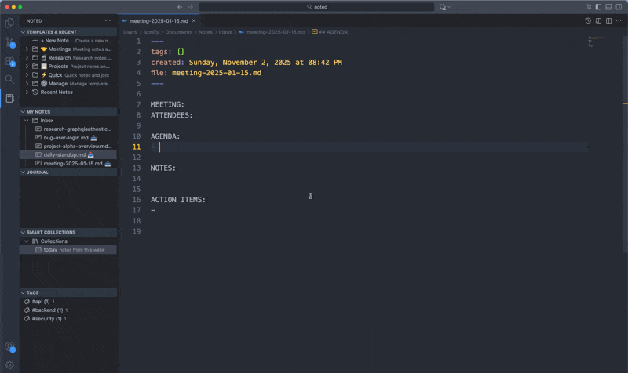
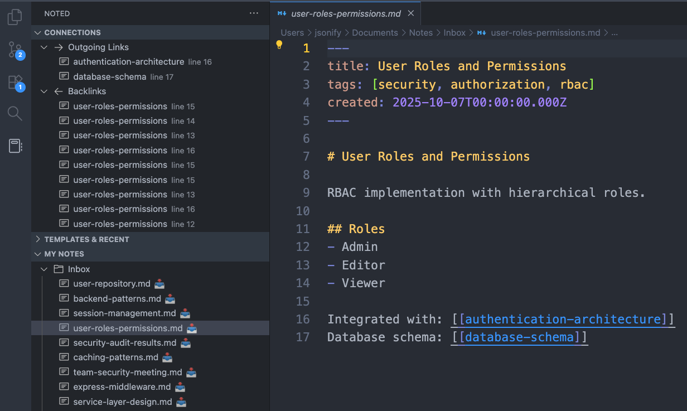

# Noted - Your Personal Knowledge Base in VS Code

> **💖 Love Noted? Help us grow!** This extension is built and maintained by the community. If you find Noted useful, please [**rate and review it on the VS Code Marketplace**](https://marketplace.visualstudio.com/items?itemName=jsonify.noted&ssr=false#review-details) — your feedback helps others discover Noted and motivates us to keep improving. Every star counts! ⭐

---
[Repository](https://github.com/jsonify/noted)  |  [Issues](https://github.com/jsonify/noted/issues)  |  [Documentation](https://jsonify.github.io/noted/)

[](https://github.com/jsonify/noted/actions/workflows/ci.yml)

**One notes folder. Every workspace. Always accessible.**

A comprehensive note-taking and knowledge management system inspired by Foam and Obsidian, built right into A [Visual Studio Code](https://code.visualstudio.com) [extension](https://marketplace.visualstudio.com/items?itemName=jsonify.noted). Connect your thoughts with wiki-style links, visualize your knowledge graph, and organize with powerful search and tagging—no matter which codebase you're working in.

Unlike workspace-bound solutions, Noted gives you a persistent home for all your notes that follows you across every project. Your knowledge base travels with you.

Noted is free, open source, and keeps your data in plain markdown files you own. 

---

## 🌟 Your Notes, Everywhere

**The problem**: You work across multiple projects, but your notes are scattered—some in project folders, some in random locations, lost in different workspaces.

**The Noted solution**: Configure your notes folder once (like `~/Documents/Notes` or `~/Dropbox/Notes`), and access it from **any VS Code workspace** with a single click. Your knowledge base travels with you.


Whether you're working on a client project, personal code, or company repository, your notes are always one click away in the sidebar. Take meeting notes, document discoveries, and link ideas without switching contexts or losing track of where you put things.

### Why This Matters

- ✅ **Persistent knowledge base** - Your notes aren't tied to any single project
- ✅ **Cross-project insights** - Link notes from different work contexts together
- ✅ **One source of truth** - All your professional knowledge in one searchable location
- ✅ **Zero setup per project** - Open any workspace, your notes are already there
- ✅ **Cloud-sync ready** - Put your notes folder in Dropbox/iCloud/OneDrive, sync everywhere

---

## Core Features

### Connect your notes with [[wikilinks]]



Create connections between notes using `[[wikilinks]]`. Noted provides autocomplete as you type, instant navigation with click-through links, and automatic link updates when you rename or move files. Use `[[note|display text]]` for readable link labels, or `[[folder/note]]` to disambiguate notes with the same name.

### Visualize your knowledge network


See your entire note network at a glance with the interactive graph visualization. Click nodes to navigate between notes, drag to explore relationships, and use filters to focus on specific time periods or connection patterns. The graph adapts to your note density with smart physics and hover-to-reveal labels that keep the view clean.

### See all connections in real-time



The Connections panel shows all notes linking to and from your current note, with context snippets showing exactly where connections appear. Click any backlink to jump to the source note at the exact line where the link lives. The panel updates in real-time as you work, keeping you aware of your note relationships without breaking your flow.

### Embed notes, images, and diagrams inline

Include content from other notes using `![[note-name]]` or embed specific sections with `![[note-name#Section]]`. Display images inline with `![[image.png]]` and embed diagrams with `![[diagram.drawio]]`. Build comprehensive documents from reusable pieces, with live updates as source content changes.

### Create and manage diagrams seamlessly

Centralized diagram management with Draw.io and Excalidraw support. Create diagrams from the Diagrams panel, automatically copy embed syntax to your clipboard, and paste `![[diagram.drawio]]` into any note. All diagrams are stored in a single folder for easy organization, with automatic discovery from nested note locations.

### Organize with flexible tags

Tag notes inline with `#hashtags` or in YAML frontmatter (`tags: [work, backend, bug]`). Get autocomplete suggestions as you type `#`, filter notes by single or multiple tags, and see usage counts at a glance in the Tags panel. Sort alphabetically or by frequency to find your most-used organizational categories.

### Find anything with powerful filters

Combine regex patterns, tag filters, and date ranges to find exactly what you need. Use advanced syntax like `regex: tag:backend from:2025-01-01 auth.*error` to search across thousands of notes instantly. Results show match counts, tags, modification dates, and rich context previews.

### Navigate daily notes visually


Visual monthly calendar for daily notes with highlighted indicators showing days with existing content. Click any date to see all notes created that day, create new dated notes, or jump between months with Previous/Today/Next navigation. Perfect for journaling and daily standup workflows.

### Keep your knowledge base healthy

Identify orphaned notes (no incoming or outgoing links) and placeholder links (references to notes that don't exist yet). The Orphans panel shows three categories: isolated notes, notes with no backlinks, and notes with no outgoing links. The Placeholders panel groups broken links by target, showing all source locations with context snippets and line numbers.

### AI-powered summarization with GitHub Copilot

Generate intelligent summaries of your notes using GitHub Copilot. Summarize single notes instantly or batch process multiple notes by time period (week, month, custom range). Summaries extract key insights, action items, and keywords with smart caching for instant access. Use custom prompt templates for different contexts (meeting notes, technical reviews, brainstorm sessions) and track summary versions over time. Auto-tag notes based on AI-extracted keywords.

### Create multi-note workflows with bundles


Need to create multiple related notes at once? Bundles let you scaffold entire workflows in seconds. Use built-in bundles for common patterns (video tutorials, project planning, research papers) or create your own. Fill in a few variables like project name and date, and watch as Noted creates multiple notes with automatic wiki-links connecting them. Perfect for recurring workflows that would otherwise require manual setup every time.

**📖 [Read the Bundles Guide](./docs/bundles.md)** for examples and step-by-step instructions.

---

## Quick Commands

- **Cmd+Shift+N** (Mac) / **Ctrl+Shift+N** (Windows/Linux) - Open today's note instantly
- **Cmd+Shift+T** / **Ctrl+Shift+T** - Insert timestamp at cursor
- Type **[[** - Autocomplete available notes with intelligent suggestions
- Type **#** - Autocomplete existing tags with usage counts
- Type **![[** - Embed notes, images, or diagrams inline

---

## Installation

### 1. Install the Extension

Open VS Code Extensions (**Cmd+Shift+X** / **Ctrl+Shift+X**) → Search for "**Noted**" → Click **Install**

### 2. Configure Your Notes Home (First Time Only)

When you first use Noted, you'll be prompted to choose where to store your notes.

**Recommended locations:**

```bash
# macOS/Linux
~/Documents/Notes          # Local, backed up by Time Machine/system backups
~/Dropbox/Notes           # Cloud-synced across devices
~/Library/Mobile Documents/com~apple~CloudDocs/Notes  # iCloud Drive

# Windows
C:\Users\YourName\Documents\Notes     # Local
C:\Users\YourName\Dropbox\Notes       # Cloud-synced
```

**Important:** Choose a location **outside** any specific project folder. This ensures your notes are accessible from every workspace.

### 3. Start Taking Notes

Press **Cmd+Shift+N** (Mac) or **Ctrl+Shift+N** (Windows/Linux) to open today's note.

Your notes are now accessible from any VS Code workspace! 🎉

---

## Getting Started

### First-Time Setup (Do Once)

1. **Install Noted** from VS Code Marketplace
2. **Choose your notes home** - Pick a location outside your project folders:
   - Recommended: `~/Documents/Notes` or `~/Dropbox/Notes`
   - Avoid: Inside any specific project/workspace folder
3. **Start taking notes** - Press Cmd+Shift+N to create today's note

That's it! Your notes are now accessible from every VS Code workspace you open.

### Daily Workflow

Noted works best when you:

1. **Keep one unified notes folder** - Don't create separate notes per project
2. **Link liberally** - Use `[[wikilinks]]` to connect related thoughts
3. **Tag for organization** - Use `#tags` to categorize and filter notes
4. **Review connections** - Use the graph view and connections panel to discover relationships
5. **Open today's note each morning** - Cmd+Shift+N becomes your daily ritual
6. **Build atomic notes** - One topic per note keeps things focused and linkable

### The Power of Persistent Notes

Unlike workspace-specific notes, Noted's approach means:
- Meeting notes from last week's client call? Still there when you switch projects.
- Research on that authentication pattern? Available in your new side project.
- Bug investigation from six months ago? Searchable and linkable, no matter where you are.

**Your knowledge compounds over time, not trapped in project folders.**

---

## Why Choose Noted Over Other Solutions?

| Approach | Access Pattern | Problem |
|----------|---------------|---------|
| **Workspace .vscode/notes/** | Only in that project | Notes disappear when switching workspaces |
| **Project /docs/ folder** | Per-project only | Knowledge scattered across repos |
| **Random text files** | Wherever you saved them | Can't find anything, no connections |
| **Separate notes app** | Outside VS Code | Context switching kills flow |
| **✅ Noted** | **One folder, every workspace** | **Always accessible, fully connected** |

With Noted, your notes folder is like your home—you can visit from anywhere, and everything you need is always in the same place.

---

## Real-World Workflows

### Scenario 1: Freelance Developer
**The Setup**: Notes folder at `~/Dropbox/Notes`

**The Workflow**:
- Monday morning: Open Client A's project → Cmd+Shift+N → Daily standup notes
- Monday afternoon: Switch to Client B's project → Same notes appear in sidebar
- Tuesday: Link yesterday's Client A solution to today's Client B problem
- Friday: Search "authentication bug" → Find notes from both clients, compare approaches

**The Win**: Knowledge from one client helps another. Your notes bridge all your work.

### Scenario 2: Startup Team Member
**The Setup**: Notes folder at `~/Documents/Work-Notes`

**The Workflow**:
- AM: Work on frontend repo → Take architecture notes with `[[wiki-links]]`
- PM: Switch to backend repo → Reference morning's frontend notes via graph view
- Next week: Switch to mobile repo → Search across all previous notes
- Next month: New project → All context from previous work still accessible

**The Win**: Company knowledge stays connected even as you move between codebases.

### Scenario 3: Open Source Contributor + Day Job
**The Setup**: Notes folder at `~/Notes`

**The Workflow**:
- 9-5: Work on proprietary company code → Take meeting notes, tag with `#work`
- Evening: Contribute to OSS project → Link work learnings to OSS ideas
- Weekend: Personal learning project → Search across work + OSS notes
- Graph view reveals patterns across all contexts

**The Win**: Your entire professional knowledge base is unified and searchable.

---

## Configuration

Access settings via VS Code Settings (search for "Noted"):

- **noted.notesFolder**: Where notes are stored (default: "Notes")
- **noted.diagramsFolder**: Where diagrams are stored (default: "Diagrams")
- **noted.fileFormat**: File format - "txt" or "md" (default: "md")
- **noted.tagAutoComplete**: Tag suggestions when typing # (default: true)
- **noted.autoBacklinks**: Auto-append backlinks sections (default: true)

### AI Summarization Settings

- **noted.ai.enabled**: Enable AI-powered features (default: true)
- **noted.ai.summaryLength**: Summary length - "short", "medium", or "long" (default: "medium")
- **noted.ai.summaryFormat**: Format - "paragraph", "bullets", or "structured" (default: "structured")
- **noted.ai.includeActionItems**: Extract action items in summaries (default: true)
- **noted.ai.includeKeywords**: Generate keywords/tags from content (default: false)
- **noted.ai.cacheEnabled**: Cache summaries for performance (default: true)

**Requirements:** GitHub Copilot extension with active subscription

### Graph View Settings

- **noted.graph.style.fontSize**: Font size for node labels in pixels (default: 11)
- **noted.graph.titleMaxLength**: Maximum label length before truncation (default: 24)
- **noted.graph.physics.chargeStrength**: Node repulsion strength (default: -120)
- **noted.graph.physics.linkDistance**: Target distance between connected nodes (default: 50)

---

## Development

### Setup

```bash
# Clone repository
git clone https://github.com/jsonify/noted.git
cd noted

# Install dependencies
pnpm install

# Compile TypeScript
pnpm run compile

# Run tests
pnpm run test:unit
```

### Testing

```bash
# Unit tests (325 passing)
pnpm run test:unit

# Integration tests
pnpm run test

# Package extension
pnpm dlx @vscode/vsce package
```

**Test Coverage:**
- 325 unit tests covering all functionality
- Cross-platform CI/CD (Ubuntu, macOS, Windows)
- Multiple Node versions (18.x, 20.x)

---

## Documentation

📖 **[Full Documentation](https://jsonify.github.io/noted)**

**Topics:**
- Getting Started Guide
- Daily Notes Workflow
- Wiki-Style Links & Connections
- Diagrams Panel & Management
- Note, Image & Diagram Embeds
- Graph View Tutorial
- Tags System
- Advanced Search
- Calendar View
- AI Summarization (GitHub Copilot)
- **[Multi-Note Workflow Bundles](./docs/bundles.md)** ⭐ NEW
- Bulk Operations & Undo/Redo
- Templates Guide
- Pinned Notes & Archive

---

## Contributing

Contributions welcome! Please:
1. Fork the repository
2. Create a feature branch
3. Add tests for new features
4. Follow existing code style
5. Submit a Pull Request

See [CONTRIBUTING.md](CONTRIBUTING.md) for detailed guidelines.

---

## Support

- **Issues**: [GitHub Issues](https://github.com/jsonify/noted/issues)
- **Discussions**: [GitHub Discussions](https://github.com/jsonify/noted/discussions)
- **Documentation**: [Website](https://jsonify.github.io/noted)

---

## License

MIT License - see [LICENSE](LICENSE)

---

## Acknowledgments

Built with ❤️ for the VS Code community

**Inspired by:**
- [Foam](https://foambubble.github.io/foam/) - Personal knowledge management for VS Code
- [Obsidian](https://obsidian.md/) - Powerful knowledge base on local markdown files

**Technologies:**
- TypeScript
- VS Code Extension API
- Vis.js (graph visualization)
- Mocha & Chai (testing)

---

**Your knowledge, unified. Your notes, everywhere.**